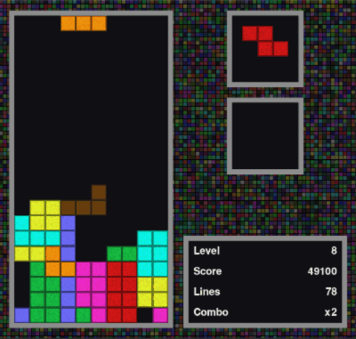

# Tetris-RL

A RL-based Tetris playing agent.   UofT CSC2515 Course Project



## Introduction

This repo contains codes for our project. A model-based value iteration algorithm is proposed to make AI to play Tetris with promising performance (1000+ lines per game).  The repo also contains codes for other exploratory methods that fail to get good performance.

## Environment

We adopt an existing Tetris Pygame implementation from [GitHub](https://github.com/Uglemat/MaTris). Lots of modifications are made to the original codes in order to support OpenAI Gym like interface and multiprocessing acceleration. The environment we used has following properties:

### Action Space

For simplicity, for each training step, a new tetromino will appear on the top of board. Therefore,  our action is a combination of rotation and translation. Once `env.step(action)` is called, a series of rotation and translation will be made to let tetromino drop down to the bottom. Specifically, rotation has four direction `[0,1,2,3]`, translation has ten dropping positions `[-5,-4,-3,-2,-1,0,1,2,3,4]`. Thus, there are 40 actions `[0,1,2,3]x[-5,-4,-3,-2,-1,0,1,2,3,4]`  to consider for each step.

### Observation Space (State)

The game board will be converted to a 01 matrix to represent the current state. We did not use manually extracted indicators as states.

### Reward

* Game scoring system is almost copy of official scoring system from https://tetris.wiki/Scoring.
* Other reward can be manually added to help training. See code [utils\board_utils.py](utils\board_utils.py)

## Agent

### The overview of method pipeline.


### Value Network Architecture


## Codes

### Environments

Some necessary Python3 packages

```bash
numpy
pytorch>=1.4.0
tensorflow # for tensorboard
pygame # for GUI
curses # for visualization in terminal (not support Windows)
gym
```

### Train your agent

```
python value_iteration.py
```

Note: 

* hyperparameters can be tuned in [`value_iteration.py`](value_iteration.py) or [`utils/hyperparameters.py`](utils/hyperparameters.py); 
* efficient training may require a GPU for acceleration.

### Demo

```bash
python demo.py
```

Gif demo is on the top of this README.md

### Other Viz

Feature Map Visualization


